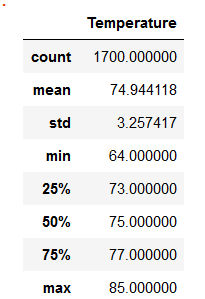
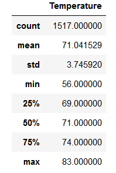

# Surf-Cream Invesment Analysis

## Project Overview
The purpose of this report is to present my findings to W. Avery on the suitability of the Hawaii island Oahu as a potential destination for the startup "Surf-Cream". "Surf-Cream" is a possible business that W.Avery and I are considering setting up. The premise of the company is to sell ice cream, shakes, and other cold desserts to customers in addition to providing surfboards and other surfing equipment while they are surfing in the ocean. Our ideal location would be near a beach on Oahu, however, we need more information in regards to the weather conditions on the island. Due to making a previous mistake in investing in a business with a similar concept in a rainy area, it is paramount that we make the proper analysis of the climate before proceeding to invest in “Surf-Cream”. 

## Project Results

We analyzed about seven years’ worth of weather data from 2010 to 2017. For this analysis, we focused on the months of June and December for the entire period under consideration. The following figures show summary statistics for each month: Figure 1-1 is for June and Figure 1-2 is for December. 

Figure 1-1

Figure 1-2

Here is our analysis of the data:

•	For June, there were 1,700 data points analyzed which means that the sample was large enough for robust analysis. The average temperature in June for all seven years was about 75 degrees Fahrenheit with a standard deviation of 3.25 degrees. This suggests that the temperature for the island during the summer is fair enough for surfing and yet not too cool to deter potential customers from eating ice cream while they are on the beach. Also, the low standard deviation is encouraging in that it suggests that the moderately warm temperatures do not vary much during the summer. This insight is further supported by looking at the three quarters of the data set (i.e., the bottom 25%, 50%, and 75%). You can see that among these three thresholds, the temperatures do not vary much from 73 degrees (in the  bottom 25%) to 77 degrees (for the bottom 75%), producing an IQR of 4 degrees. 

•	For December, there were 1,517 data points analyzed which also means that the sample for this month was large enough for robust analysis. The average temperature in December for all seven years was about 71 degrees with a standard deviation of 3.75 degrees. Just like June, December is a relatively moderately warm month for the region. The conditions are also ideal for surfing and eating cold desserts while on the beach. As with June, the quartiles for December suggests that the relatively mild, warm weather that the region experiences is stable and does not vary much from day to day. The bottom 25% of the data set contains days with 69 degrees or lower while the bottom 75% of the day set contains days with 74 degrees or lower. Again, a 5 degree IQR would not be considered very wide and thus, suggests again that the warm weather in Oahu is fairly stable.

•	As the reader can see, the temperature differences from arguably the two most extreme weather months (i.e. June and December) were not that great. One would think that the weather would be too hot in June for surfing and too cold in December for both surfing and ice cream. However, this turn out not to be the case as both months were relatively warm and almost had the same average temperatures. Though this sample was small in terms of analyzing just two of the twelve month periods within the year, it does suggests that Oahu typically experiences mild, warm weather year-round which is more than ideal for “Surf-Cream”. 

## Summary

Based on the parameters of the analysis and its results, I believe that Oahu is a good location for our investment in “Surf-Cream”. We have plenty of data to suggests that we should expect the same, moderately warm temperatures in the region during months that usually experience extreme temperature differences. Indeed, we could argue from this analysis alone that we should expect these conditions throughout the year based on picking one month in the summer and the other in the winter. This would suggest then that we could have Surf-Cream open for business all twelve months of the year.

However, we need to analyze the precipitation data as well to ensure that it does not rain too much during the year in Oahu. Performing the queries on precipitation patterns in June and December should be enough to infer whether Oahu experiences significant amounts of rain or not. If there is too much rain, then Surf-Cream could fall victim to failure just like the previous surfing and ice cream business did last year. 

Finally, another area of analysis that I would propose would be for us to examine the number of stations reporting on the weather data and how active they are in their reporting. Specifically, we should analyze the station data for June and December so that we can be confident enough in their numbers. 
